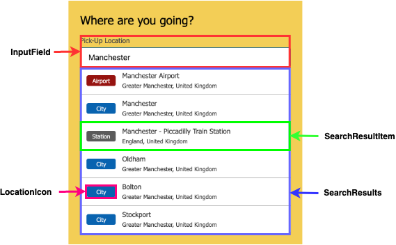

# Search App

You can find the search app example [here](https://stoutyalex.github.io/search-app)

## Run Locally
To run the search app locally clone the repo
```
git clone git@github.com:StoutyAlex/search-app.git
cd search-app
```

Start Webpack Server
```
npm start
```

Build App
```
npm run build
```

## Testing
A range of different tests cover this project. Built using the TDD methodology and topped off with Visual Regression Tests to check the functionality of the Search App as a whole

### Unit Testing

Run linting and unit tests
```
npm test 
```
Run unit and lint respectively
```
npm run test:unit
npm run test:lint
```

### Manual Testing
Manually tested on IE11 and Safari browsers. Used Polyfill and Babel to achieve this

### Visual Regression Tests
Visual Regression Tests act as the integration/End to End tests to check that everything is working as required.

They operate initially by creating a `baseline` screenshot. Then when the tests are run it will take the same screenshot of the same component / area on the site and compare it. If its the same then all good if not it will generate a `latest` and `diff` screenshot that shows you the error in a visual format.

#### Running the Visual Regression Tests

##### Locally
You will need to run the sev server in a seperate terminal to run against local environment
```
npm run test:e2e:local
``` 

##### Production
This will hit the [github pages](https://stoutyalex.github.io/search-app) url
```
npm run test:e2e
```

## Components
This was built in mind that any generic components that could be reused can be resued. This project it was more of a demonstration rather than full execution.

Here is how the components are arranged within the search-app



You can view each one of the components and the varients, props, JSX, Accessability checks and notes within the storybook for this project.

### Storybook

Click here for the [Storybook](https://stoutyalex.github.io/search-app/storybook) that contains all the reusuable components within this project.
